# Hi there, I'm Adam 👋

Welcome to my GitHub profile! I'm a passionate software engineer with a love for creating efficient, scalable, and impactful solutions. I enjoy exploring new technologies and contributing to cyber security & operational efficiency for for businesses.

---

## 🚀 About Me

- 🔭 I’m currently working on **some really cool stuff**
- 🌱 I’m currently learning **[AI]**
- 👯 I’m looking to collaborate on **[Using AI to detect potential vulnerabilities]**
- 💬 Ask me about **[REST APIs, Cyber Security, Operational Efficiency]**
- ⚡ Fun fact: **["⚡ Fun fact: I love cycling in the mountains! Some of my best ideas come to me while navigating challenging mountain trails on two wheels."]**

---

## 🛠️ Technologies & Tools

---

## 📈 GitHub Stats

  
  

---

## 🏆 Achievements

- 🥇 **[Top Innovative Solution for Securing REST APIs]**
- 🥈 **[Top Innovative Solution for increasing operational efficiency of REST APIs]**
- 🥇 **[Top Innovative Design for an effective cyber attack on REST APIs]**
- 🥇 **[Top Innovative Design for an effective cyber attack on Mobile Apps]**

---

## 🔗 Let's Connect

- 
- 
- 

---

Thank you for visiting my profile! Feel free to reach out if you'd like to collaborate on a project or just have a chat. 😊
